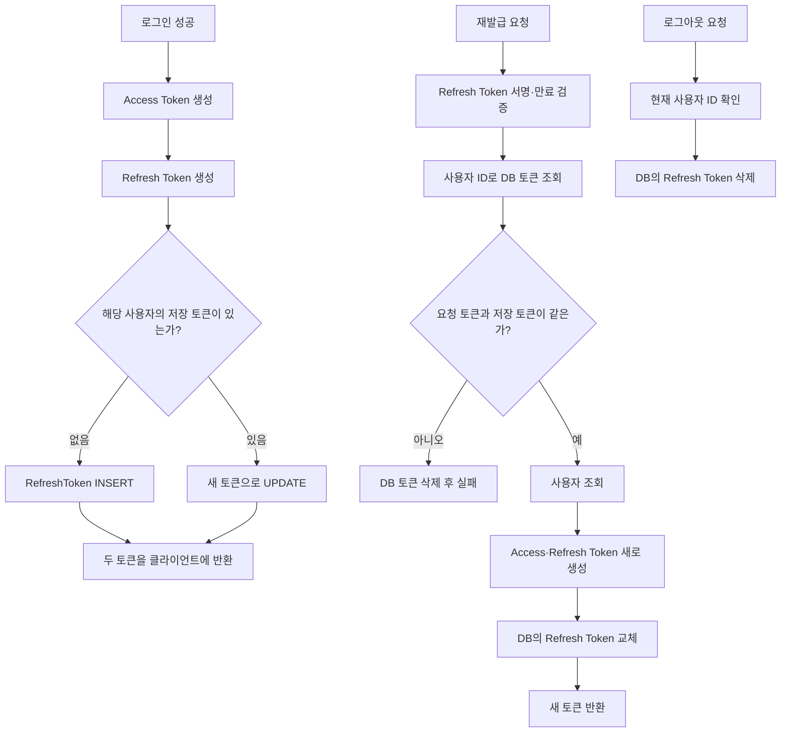
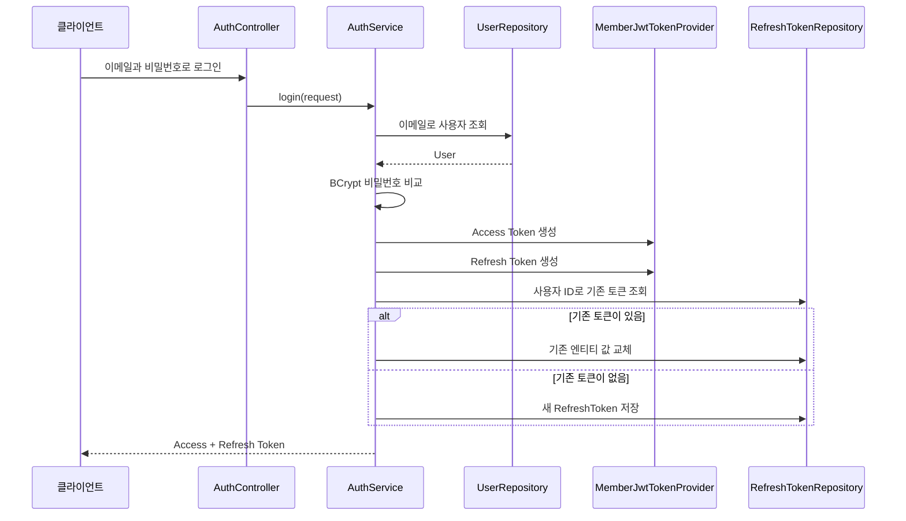

# 11. Refresh Token 저장·재발급·로그아웃

- 커밋: `ab3c61e`
- 커밋 메시지: `feat: Refresh Token 저장 및 재발급·로그아웃 구현`

## 이번 단계에서 한 일

이전 단계에서는 로그인할 때 Access Token과 Refresh Token을 만들어 클라이언트에 반환했다.

하지만 Refresh Token을 서버에 저장하지 않았기 때문에 서버가 어떤 Refresh Token을 발급했는지 확인하거나, 로그아웃한 토큰을 무효화할 방법이 없었다.

이번 단계에서는 Refresh Token을 DB에 저장하고 다음 기능을 추가했다.

```text
Refresh Token 관리
├─ 로그인 시 DB에 저장
├─ 사용자별로 한 개만 유지
├─ 재로그인 시 기존 토큰 교체
├─ 재발급 시 저장된 토큰과 비교
├─ 재발급 성공 시 새 토큰으로 회전
└─ 로그아웃 시 DB에서 삭제
```

## 변경된 파일

```text
src/main/java/com/example/emotiondiary/
├─ controller/
│  └─ AuthController.java
├─ dto/auth/
│  └─ ReissueRequest.java
├─ entity/
│  └─ RefreshToken.java
├─ repository/
│  └─ RefreshTokenRepository.java
└─ service/
   └─ AuthService.java
```

## Access Token과 Refresh Token 복습

두 토큰은 목적과 수명이 다르다.

| 구분 | Access Token | Refresh Token |
|---|---|---|
| 목적 | 보호된 API 요청 | Access Token 재발급 |
| 사용 빈도 | API 요청마다 | Access Token 만료 시 |
| 만료 시간 | 비교적 짧음 | 비교적 긺 |
| 노출 시 영향 | 만료 전까지 API 접근 가능 | 새 Access Token을 계속 발급할 가능성 |

```text
Access Token
└─ 일기 조회·생성·수정·삭제 요청에 사용

Refresh Token
└─ Access Token이 만료됐을 때 새 토큰 발급에 사용
```

Access Token은 짧게 유지해 탈취 피해를 줄이고, Refresh Token으로 사용자가 매번 이메일과 비밀번호를 입력하지 않아도 새 Access Token을 받을 수 있게 한다.

Refresh Token은 수명이 긴 만큼 안전하게 관리해야 한다.

## 왜 Refresh Token을 DB에 저장할까?

JWT는 서버가 별도의 세션을 저장하지 않아도 서명만 검증하면 사용할 수 있다.

하지만 Refresh Token도 서명만 확인하면 다음 문제가 생긴다.

```text
사용자 로그아웃
→ 클라이언트가 토큰을 지움
→ 탈취된 Refresh Token은 다른 곳에 남아 있음
→ 만료될 때까지 재발급 요청 가능
```

서버가 DB에 현재 유효한 Refresh Token을 저장하면 두 가지를 함께 확인할 수 있다.

```text
1. JWT 자체가 정상인가?
2. 서버 DB에 저장된 현재 토큰과 같은가?
```

로그아웃할 때 DB의 토큰을 삭제하면 JWT 만료 시간이 남아 있어도 서버가 더 이상 유효한 Refresh Token으로 인정하지 않는다.

## 전체 흐름



## RefreshToken 엔티티

```java
@Entity
@Table(name = "refresh_token")
@Getter
@NoArgsConstructor(access = AccessLevel.PROTECTED)
public class RefreshToken {
}
```

JPA는 이 클래스를 읽고 `refresh_token` 테이블과 연결한다.

```text
RefreshToken 클래스
└─ refresh_token 테이블
```

### 필드와 메서드 정리

```text
RefreshToken
├─ id: Refresh Token 행의 기본키
├─ userId: 토큰을 발급받은 사용자 ID
├─ token: 실제 Refresh Token 문자열
├─ expiresAt: 토큰 만료 예정 시각
├─ RefreshToken(...): 새 저장 객체 생성
└─ rotate(): 기존 토큰과 만료 시각 교체
```

### id

```java
@Id
@GeneratedValue(strategy = GenerationType.IDENTITY)
private Long id;
```

`id`는 `refresh_token` 테이블의 기본키다.

`IDENTITY` 전략을 사용하므로 MariaDB의 `AUTO_INCREMENT`를 이용해 1, 2, 3처럼 자동으로 생성된다.

이 ID는 사용자 ID가 아니라 Refresh Token 데이터 한 행의 ID다.

### userId

```java
@Column(name = "user_id", nullable = false, unique = true)
private Long userId;
```

Refresh Token의 주인을 나타내는 사용자 ID다.

```text
nullable = false
└─ user_id는 반드시 있어야 함

unique = true
└─ 같은 user_id를 두 행에 저장할 수 없음
```

`unique = true` 덕분에 한 사용자당 Refresh Token을 하나만 저장한다.

```text
허용
user_id 1 → Refresh Token A
user_id 2 → Refresh Token B

허용하지 않음
user_id 1 → Refresh Token A
user_id 1 → Refresh Token C
```

이번 코드에서는 `User` 엔티티와 `@OneToOne` 관계를 맺지 않고 단순한 `Long userId`만 저장했다.

### token

```java
@Column(nullable = false, length = 512)
private String token;
```

실제 Refresh Token 문자열을 저장한다.

JWT는 일반 문자열보다 길기 때문에 최대 길이를 `512`로 지정했다.

### expiresAt

```java
@Column(name = "expires_at", nullable = false)
private LocalDateTime expiresAt;
```

Refresh Token이 만료되는 시각을 저장한다.

현재 재발급 코드는 JWT 내부의 `exp`를 검증하며, DB의 `expiresAt`을 직접 비교하지는 않는다. 따라서 이 필드는 현재 기록용에 가깝고, 나중에 만료 데이터 정리 등에 사용할 수 있다.

### 생성자

```java
public RefreshToken(Long userId, String token, LocalDateTime expiresAt) {
    this.userId = userId;
    this.token = token;
    this.expiresAt = expiresAt;
}
```

처음 로그인한 사용자처럼 저장된 토큰이 없을 때 새 객체를 만든다.

ID는 DB가 자동 생성하므로 생성자에서 받지 않는다.

### rotate()

```java
public void rotate(String newToken, LocalDateTime newExpiresAt) {
    this.token = newToken;
    this.expiresAt = newExpiresAt;
}
```

이미 저장된 Refresh Token을 새로운 값으로 교체한다.

`rotate`는 회전이라는 뜻이다.

```text
기존 Refresh Token A
→ 새 Refresh Token B 발급
→ DB 값을 B로 교체
→ A는 더 이상 사용할 수 없음
```

이 메서드는 `@Transactional` 안에서 호출된다. JPA의 변경 감지가 작동하므로 별도의 `save()`를 다시 호출하지 않아도 트랜잭션이 끝날 때 `UPDATE` 쿼리가 실행된다.

## RefreshTokenRepository

```java
public interface RefreshTokenRepository
        extends JpaRepository<RefreshToken, Long> {
}
```

`JpaRepository<RefreshToken, Long>`의 의미는 다음과 같다.

```text
RefreshToken
└─ 관리할 엔티티

Long
└─ RefreshToken의 @Id 타입
```

기본적인 저장, 조회, 삭제 기능을 자동으로 제공한다.

### findByUserId()

```java
Optional<RefreshToken> findByUserId(Long userId);
```

사용자 ID로 저장된 Refresh Token을 찾는다.

로그인할 때 기존 토큰이 있는지 확인하고, 재발급할 때 서버가 기억하는 현재 토큰을 가져오는 데 사용한다.

### findByToken()

```java
Optional<RefreshToken> findByToken(String token);
```

토큰 문자열로 데이터를 찾는 메서드다.

다만 `ab3c61e` 커밋의 실제 서비스 코드에서는 이 메서드를 아직 사용하지 않는다. 재발급 시 사용자 ID로 행을 찾은 뒤 Java 코드에서 토큰 문자열을 비교한다.

### deleteByUserId()

```java
void deleteByUserId(Long userId);
```

사용자 ID에 해당하는 Refresh Token을 삭제한다.

다음 두 상황에서 사용한다.

```text
로그아웃
└─ 현재 사용자의 Refresh Token 삭제

저장 토큰 불일치
└─ 탈취 가능성이 있다고 보고 Refresh Token 삭제
```

메서드 이름을 분석해 Spring Data JPA가 필요한 쿼리를 자동으로 만든다.

## ReissueRequest DTO

```java
@Getter
@NoArgsConstructor
public class ReissueRequest {

    @NotBlank
    private String refreshToken;
}
```

토큰 재발급 API가 요청 JSON을 받을 때 사용하는 DTO다.

```json
{
  "refreshToken": "eyJhbGciOiJIUzI1NiJ9..."
}
```

`@NotBlank`는 값이 다음과 같은 경우 검증에 실패시킨다.

```text
null
빈 문자열 ""
공백만 있는 문자열 "   "
```

Controller의 `@Valid`가 이 검증을 실행한다.

## 로그인 흐름 변경

이전에는 로그인 메서드가 토큰을 바로 생성해 응답했다.

이번에는 사용자 검증이 끝나면 공통 메서드인 `issueTokens()`를 호출한다.

```java
return issueTokens(user);
```

따라서 로그인할 때도 Refresh Token이 DB에 저장된다.



같은 사용자가 다시 로그인하면 새 행을 계속 추가하지 않고 기존 행의 토큰을 교체한다.

```text
첫 로그인
→ INSERT

재로그인
→ UPDATE
→ 이전 Refresh Token 사용 불가
```

이 정책에서는 한 사용자가 여러 기기에서 로그인하더라도 가장 최근에 로그인한 기기의 Refresh Token 하나만 유지된다. 새 기기에서 로그인하면 기존 기기의 Refresh Token은 재발급에 사용할 수 없다.

## issueTokens()

로그인과 재발급에서 공통으로 사용하는 토큰 발급 메서드다.

```java
private TokenResponse issueTokens(User user) {
    String accessToken = tokenProvider.createAccessToken(user);
    String refreshToken = tokenProvider.createRefreshToken(user);
    // ...
}
```

### 1. 두 토큰 생성

```text
createAccessToken(user)
└─ API 인증에 사용할 Access Token

createRefreshToken(user)
└─ 재발급에 사용할 Refresh Token
```

### 2. 만료 시각 계산

커밋의 코드는 다음과 같다.

```java
LocalDateTime expiresAt = LocalDateTime.now()
        .plusSeconds(tokenProvider.getRefreshExpMin());
```

여기에는 시간 단위가 맞지 않는 문제가 있다.

`getRefreshExpMin()`의 `Min`은 분을 의미하지만 `plusSeconds()`는 초를 더한다.

예를 들어 설정값이 `1440`이라면:

```text
JWT 내부 만료 시간
1440분 = 24시간

DB expires_at
1440초 = 24분
```

분 단위를 그대로 사용하려면 다음과 같이 작성하는 것이 맞다.

```java
LocalDateTime expiresAt = LocalDateTime.now()
        .plusMinutes(tokenProvider.getRefreshExpMin());
```

현재 코드는 DB의 `expiresAt`으로 유효성을 검사하지 않기 때문에 바로 재발급을 막지는 않지만, 데이터에 기록되는 만료 시각이 JWT의 실제 만료 시간과 달라진다. 이후 만료 토큰 정리 기능을 만들 때 문제가 될 수 있으므로 수정해야 한다.

### 3. 저장 또는 교체

```java
refreshTokenRepository.findByUserId(user.getId())
        .ifPresentOrElse(
                rt -> rt.rotate(refreshToken, expiresAt),
                () -> refreshTokenRepository.save(
                        new RefreshToken(user.getId(), refreshToken, expiresAt)
                )
        );
```

`ifPresentOrElse()`는 `Optional`에 값이 있는지에 따라 다른 코드를 실행한다.

```text
기존 RefreshToken 있음
→ rotate()로 값 교체

기존 RefreshToken 없음
→ 새 엔티티를 save()
```

### 4. TokenResponse 반환

```java
return TokenResponse.builder()
        .accessToken(accessToken)
        .refreshToken(refreshToken)
        .tokenType("Bearer")
        .accessTokenExpiresIn(tokenProvider.getAccessExpMin())
        .build();
```

새로 만든 두 토큰을 클라이언트에 반환한다.

`accessTokenExpiresIn`의 주석은 초 단위지만 `getAccessExpMin()`은 분 단위 값을 반환한다. 9번 문서에서 살펴본 것처럼 응답을 초 단위로 약속했다면 `* 60`으로 변환하거나 필드 이름과 설명을 분 단위로 바꿔야 한다.

## 토큰 재발급 흐름

Controller에 다음 API가 추가됐다.

```java
@PostMapping("/reissue")
public ResponseEntity<TokenResponse> reissue(
        @Valid @RequestBody ReissueRequest request) {
    return ResponseEntity.ok(
            authService.reissue(request.getRefreshToken())
    );
}
```

요청 주소는 다음과 같다.

```http
POST /api/auth/reissue
Content-Type: application/json

{
  "refreshToken": "..."
}
```

### 1. JWT 자체 검증

```java
try {
    claims = tokenProvider.parse(refreshToken);
} catch (JwtException e) {
    throw new BusinessException(ErrorCode.INVALID_TOKEN);
}
```

서명이 잘못됐거나 만료된 토큰이면 `INVALID_TOKEN` 예외로 바꾼다.

이 커밋에서는 만료된 Refresh Token도 별도의 `EXPIRED_TOKEN`이 아니라 `INVALID_TOKEN`으로 응답한다.

### 2. 사용자 ID 추출

```java
Long userId = Long.valueOf(claims.getSubject());
```

Refresh Token의 `sub`에서 사용자 ID를 꺼낸다.

### 3. DB 토큰 조회

```java
RefreshToken stored = refreshTokenRepository.findByUserId(userId)
        .orElseThrow(() ->
                new BusinessException(ErrorCode.INVALID_TOKEN));
```

JWT가 정상이더라도 DB에 저장된 토큰이 없으면 재발급을 허용하지 않는다.

로그아웃 후 재발급이 실패하는 이유도 DB의 토큰이 삭제되기 때문이다.

### 4. 토큰 문자열 비교

```java
if (!stored.getToken().equals(refreshToken)) {
    refreshTokenRepository.deleteByUserId(userId);
    throw new BusinessException(ErrorCode.INVALID_TOKEN);
}
```

클라이언트가 보낸 토큰과 DB가 기억하는 최신 토큰이 정확히 같은지 비교한다.

다르면 이전 토큰이 다시 사용됐거나 토큰이 탈취됐을 가능성이 있다고 판단한다.

```text
요청 토큰 = DB 토큰
→ 재발급 계속

요청 토큰 ≠ DB 토큰
→ DB 토큰 삭제
→ 재발급 거부
```

DB의 정상 토큰까지 삭제하므로 사용자는 다시 로그인해야 한다.

### 5. 사용자 조회

```java
User user = userRepository.findById(userId)
        .orElseThrow(() ->
                new BusinessException(ErrorCode.USER_NOT_FOUND));
```

현재 DB의 사용자 정보를 가져온다. 새 Access Token에는 이 시점의 이메일과 권한이 들어간다.

### 6. 새 토큰 발급과 회전

```java
return issueTokens(user);
```

Access Token뿐 아니라 Refresh Token도 함께 새로 만든다.

```text
기존 Access Token A
기존 Refresh Token R1
        ↓ 재발급
새 Access Token B
새 Refresh Token R2
        ↓
DB에는 R2 저장
R1은 더 이상 사용 불가
```

이것을 Refresh Token Rotation이라고 한다.

## 로그아웃 흐름

Controller에 로그아웃 API가 추가됐다.

```java
@PostMapping("/logout")
public ResponseEntity<Void> logout(
        @AuthenticationPrincipal CustomUserDetails principal) {
    authService.logout(principal.getId());
    return ResponseEntity.noContent().build();
}
```

JWT 필터가 저장한 현재 사용자 정보를 `@AuthenticationPrincipal`로 받는다.

Service는 사용자 ID에 해당하는 Refresh Token을 삭제한다.

```java
@Transactional
public void logout(Long userId) {
    refreshTokenRepository.deleteByUserId(userId);
}
```

성공하면 본문 없이 `204 No Content`를 반환한다.

```text
로그아웃 요청
→ Access Token으로 현재 사용자 확인
→ DB의 Refresh Token 삭제
→ 이후 Refresh Token 재발급 실패
```

### 로그아웃 후 Access Token은 어떻게 될까?

DB에서 삭제하는 것은 Refresh Token뿐이다.

이미 발급된 Access Token은 서버에 저장하지 않기 때문에 로그아웃 직후에도 만료 전까지는 JWT 검증에 성공할 수 있다.

```text
로그아웃
├─ Refresh Token: 즉시 무효화
└─ Access Token: 원래 만료 시각까지 유효할 수 있음
```

이 영향을 줄이기 위해 Access Token의 만료 시간을 짧게 설정한다. Access Token까지 즉시 무효화하려면 블랙리스트 같은 별도 정책이 필요하다.

## API별 사용 방법

### 로그인

```http
POST http://localhost:8080/api/auth/login
Content-Type: application/json

{
  "email": "test@example.com",
  "password": "test1234"
}
```

로그인 성공 시 Access Token과 Refresh Token이 반환되고, Refresh Token은 DB에도 저장된다.

### 재발급

```http
POST http://localhost:8080/api/auth/reissue
Content-Type: application/json

{
  "refreshToken": "로그인 응답에서 받은 Refresh Token"
}
```

성공하면 새로운 Access Token과 Refresh Token이 반환된다. 이전 Refresh Token으로 다시 요청하면 실패한다.

### 로그아웃

```http
POST http://localhost:8080/api/auth/logout
Authorization: Bearer <Access Token>
```

로그아웃은 현재 사용자를 알아야 하므로 Access Token을 헤더에 넣어야 한다.

## 이번 코드에서 주의할 점

### 1. 로그아웃 경로가 permitAll 범위에 포함된다

현재 `SecurityConfig`는 `/api/auth/**` 전체를 `permitAll()`로 설정했다.

```java
.requestMatchers("/api/auth/**").permitAll()
```

따라서 `/api/auth/logout`도 Spring Security 인가 규칙상 인증 없이 Controller에 도착할 수 있다.

그런데 Controller는 다음 코드를 실행한다.

```java
principal.getId()
```

토큰 없이 요청하면 `principal`이 `null`일 수 있으므로 오류가 발생할 수 있다. 회원가입, 로그인, 재발급만 공개하고 로그아웃은 인증이 필요하도록 경로를 구체적으로 나누는 것이 안전하다.

예시는 다음과 같다.

```java
.requestMatchers(
        "/api/auth/signup",
        "/api/auth/login",
        "/api/auth/reissue"
).permitAll()
.anyRequest().authenticated()
```

### 2. Access Token과 Refresh Token 종류를 검사하지 않는다

`MemberJwtTokenProvider.parse()`는 서명과 만료 시간만 확인하고 토큰 종류는 확인하지 않는다.

따라서 재발급 API에 Access Token을 넣어도 1차 JWT 검증 자체는 통과할 수 있다. 그 후 DB에 저장된 Refresh Token과 문자열이 달라 토큰 불일치 처리로 넘어가며, 현재의 정상 Refresh Token까지 삭제될 수 있다.

토큰에 `type` 같은 클레임을 넣는 방법이 있다.

```text
Access Token
└─ type: access

Refresh Token
└─ type: refresh
```

재발급에서는 `type: refresh`만 허용하고, JWT 인증 필터에서는 `type: access`만 허용해야 한다.

### 3. expiresAt 시간 단위가 다르다

`refreshExpMin`은 분인데 `plusSeconds()`를 사용한다. `plusMinutes()`로 수정해야 JWT의 `exp`와 DB의 `expires_at`이 일치한다.

### 4. 토큰을 평문으로 저장한다

현재 DB에는 Refresh Token 원문이 그대로 저장된다. DB가 유출되면 토큰이 악용될 수 있다.

더 엄격하게 관리하려면 Refresh Token의 해시값을 저장하고, 요청 토큰을 같은 방식으로 해시하여 비교하는 방법을 고려할 수 있다.

### 5. 한 사용자당 한 기기 정책이다

`user_id`가 `unique`이므로 사용자별 토큰은 하나만 저장된다. 다른 기기에서 로그인하면 이전 기기의 Refresh Token이 교체된다.

여러 기기의 동시 로그인을 지원하려면 기기나 세션별로 토큰 행을 저장하는 별도 설계가 필요하다.

## 핵심 정리

```text
RefreshToken 엔티티
├─ 사용자 ID
├─ Refresh Token 문자열
└─ 만료 예정 시각 저장

RefreshTokenRepository
├─ 사용자 ID로 조회
├─ 토큰 문자열로 조회
└─ 사용자 ID로 삭제

로그인
├─ Access Token 생성
├─ Refresh Token 생성
└─ Refresh Token을 DB에 저장 또는 교체

재발급
├─ Refresh Token의 서명과 만료 검증
├─ DB에 저장된 토큰과 비교
├─ 사용자 조회
├─ Access·Refresh Token 모두 새로 발급
└─ DB 토큰을 새 Refresh Token으로 회전

로그아웃
└─ DB에서 현재 사용자의 Refresh Token 삭제
```

이번 단계의 핵심은 다음 한 문장으로 정리할 수 있다.

> Refresh Token을 DB의 현재 유효한 토큰과 비교하고, 재발급할 때마다 교체하여 서버가 재발급 권한을 통제하도록 만들었다.

## 복습 질문

<details>
<summary>1. Access Token과 Refresh Token을 나누는 이유는 무엇일까?</summary>

수명이 짧은 Access Token으로 API를 사용해 탈취 피해를 줄이면서, 수명이 긴 Refresh Token으로 로그인 없이 Access Token을 다시 발급받기 위해서다.

</details>

<details>
<summary>2. JWT인데도 Refresh Token을 DB에 저장하는 이유는 무엇일까?</summary>

서버가 현재 유효한 Refresh Token을 직접 관리하기 위해서다. DB 값과 비교하면 로그아웃한 토큰이나 이미 교체된 토큰의 재사용을 막을 수 있다.

</details>

<details>
<summary>3. <code>userId</code>에 <code>unique = true</code>를 설정하면 어떤 정책이 만들어질까?</summary>

한 사용자당 Refresh Token 행을 하나만 저장하는 정책이 된다. 새로 로그인하거나 재발급하면 기존 행의 토큰을 교체하므로 이전 기기의 Refresh Token은 사용할 수 없게 된다.

</details>

<details>
<summary>4. <code>rotate()</code>를 호출한 후 별도의 <code>save()</code>가 없어도 UPDATE되는 이유는 무엇일까?</summary>

`@Transactional` 안에서 조회한 엔티티는 JPA가 관리한다. `rotate()`로 필드가 바뀌면 JPA의 변경 감지가 이를 발견해 트랜잭션 커밋 시 자동으로 `UPDATE`한다.

</details>

<details>
<summary>5. 재발급 요청 토큰과 DB 토큰이 다르면 왜 DB 토큰까지 삭제할까?</summary>

이미 교체된 토큰이 다시 사용된 것은 탈취나 재사용 공격일 수 있기 때문이다. 서버가 저장한 토큰까지 삭제해 모든 재발급을 막고 사용자가 다시 로그인하도록 만든다.

</details>

<details>
<summary>6. Refresh Token Rotation은 무엇일까?</summary>

재발급에 성공할 때 Access Token뿐 아니라 Refresh Token도 새로 만들고 DB의 기존 Refresh Token을 교체하는 방식이다. 한 번 사용한 이전 Refresh Token은 다시 사용할 수 없다.

</details>

<details>
<summary>7. 로그아웃 후 Access Token이 바로 무효화되지 않는 이유는 무엇일까?</summary>

로그아웃은 DB에 저장된 Refresh Token만 삭제하기 때문이다. Access Token은 서버에 저장하지 않는 JWT이므로 블랙리스트 같은 추가 장치가 없다면 원래 만료 시각까지 검증에 성공할 수 있다.

</details>

<details>
<summary>8. <code>refreshExpMin</code>에 <code>plusSeconds()</code>를 사용하면 어떤 문제가 생길까?</summary>

분 단위 값을 초로 계산해 DB의 `expiresAt`이 실제 JWT 만료 시각보다 훨씬 이르게 기록된다. `refreshExpMin`을 그대로 사용하려면 `plusMinutes()`를 호출해야 한다.

</details>

<details>
<summary>9. 현재 <code>/api/auth/**</code>를 모두 <code>permitAll()</code>로 설정했을 때 로그아웃 API에는 어떤 문제가 생길 수 있을까?</summary>

토큰이 없는 요청도 로그아웃 Controller에 도착할 수 있다. 이때 `@AuthenticationPrincipal` 값이 `null`이므로 `principal.getId()`에서 오류가 발생할 수 있다.

</details>

<details>
<summary>10. Access Token과 Refresh Token의 종류를 구분해서 검증해야 하는 이유는 무엇일까?</summary>

Access Token은 일반 API 인증에, Refresh Token은 재발급에만 사용해야 하기 때문이다. 타입을 확인하지 않으면 Access Token을 재발급 API에 넣거나 Refresh Token을 인증 필터에 넣는 잘못된 사용을 완전히 막기 어렵다.

</details>
