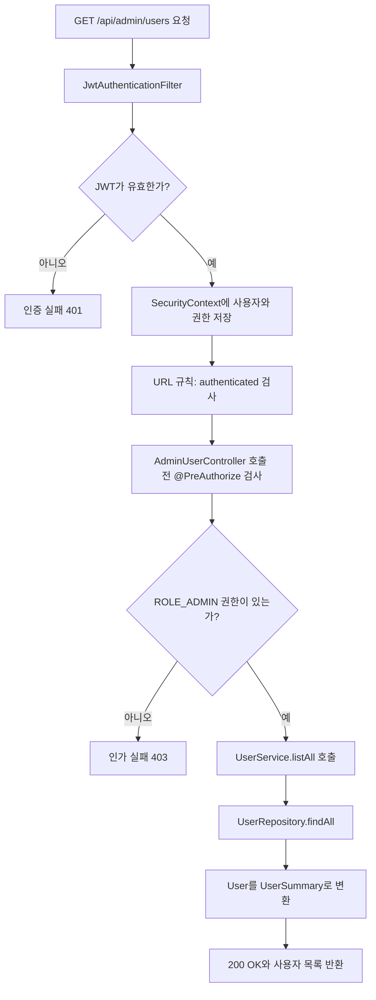

# 12. 관리자 전용 API와 메서드 인가

- 커밋: `9022469`
- 커밋 메시지: `feat: 관리자 전용 사용자 목록 API 및 권한 검사 추가`

## 이번 단계에서 한 일

이전 단계까지는 정상 JWT를 가진 사용자라면 보호된 API에 접근할 수 있었다.

이번 단계에서는 일반 사용자와 관리자가 사용할 수 있는 기능을 구분했다. 관리자만 전체 사용자 목록을 볼 수 있도록 메서드 보안을 적용했다.

```text
관리자 전용 사용자 목록 API
├─ GET /api/admin/users 추가
├─ @EnableMethodSecurity 활성화
├─ @PreAuthorize로 ADMIN 권한 검사
├─ 사용자 목록을 UserSummary DTO로 변환
└─ 권한 부족 예외를 403 응답으로 처리
```

## 변경된 파일

```text
src/main/java/com/example/emotiondiary/
├─ config/
│  └─ SecurityConfig.java
├─ controller/
│  └─ AdminUserController.java
├─ dto/
│  └─ UserSummary.java
├─ exception/
│  └─ GlobalExceptionHandler.java
└─ service/
   └─ UserService.java
```

## 인증과 인가의 차이

Spring Security를 공부할 때 인증과 인가를 구분하는 것이 중요하다.

```text
인증 Authentication
└─ 요청을 보낸 사용자가 누구인지 확인

인가 Authorization
└─ 확인된 사용자가 해당 기능을 사용할 권한이 있는지 확인
```

예를 들어 관리자 사용자 목록 API를 요청하면 다음 두 질문을 차례대로 확인한다.

```text
1. 유효한 JWT를 보냈는가?
   └─ 인증 검사

2. 인증된 사용자가 ADMIN인가?
   └─ 인가 검사
```

결과를 비교하면 다음과 같다.

| 요청 상태 | 인증 | 인가 | 결과 |
|---|---:|---:|---|
| 토큰 없음 | 실패 | 검사 불가 | 401 Unauthorized |
| 잘못된 토큰 | 실패 | 검사 불가 | 401 Unauthorized |
| USER 토큰 | 성공 | 실패 | 403 Forbidden |
| ADMIN 토큰 | 성공 | 성공 | 사용자 목록 반환 |

### 401과 403의 차이

```text
401 Unauthorized
└─ 사용자가 누구인지 확인되지 않음

403 Forbidden
└─ 사용자는 확인됐지만 필요한 권한이 없음
```

영어 이름 때문에 헷갈릴 수 있지만, 이 프로젝트에서는 토큰이 없거나 유효하지 않은 경우를 `401`, 권한이 부족한 경우를 `403`으로 이해하면 된다.

## 전체 요청 흐름



## Spring Security의 권한 정보

JWT Access Token에는 사용자의 역할이 다음과 같이 들어 있다.

```json
{
  "sub": "1",
  "email": "admin@example.com",
  "role": "ADMIN"
}
```

`JwtAuthenticationFilter`는 `role` 클레임을 꺼내 `CustomUserDetails`에 넣는다.

`CustomUserDetails.getAuthorities()`는 역할 앞에 `ROLE_`을 붙인다.

```java
return List.of(new SimpleGrantedAuthority("ROLE_" + role));
```

따라서 실제 Spring Security 권한은 다음과 같다.

```text
JWT role: USER
→ Spring Security 권한: ROLE_USER

JWT role: ADMIN
→ Spring Security 권한: ROLE_ADMIN
```

## @EnableMethodSecurity

`SecurityConfig`에 다음 어노테이션을 추가했다.

```java
@Configuration
@EnableMethodSecurity
@RequiredArgsConstructor
public class SecurityConfig {
}
```

필요한 import는 다음과 같다.

```java
import org.springframework.security.config.annotation.method.configuration.EnableMethodSecurity;
```

`@EnableMethodSecurity`는 메서드에 붙인 보안 어노테이션을 활성화한다.

```text
@EnableMethodSecurity 없음
→ @PreAuthorize를 작성해도 권한 검사가 동작하지 않음

@EnableMethodSecurity 있음
→ 메서드 호출 전에 @PreAuthorize 조건 검사
```

프로젝트 전체에서 메서드 보안을 사용할 수 있게 만드는 스위치라고 생각하면 쉽다.

## @PreAuthorize

관리자 Controller에 다음 어노테이션을 붙였다.

```java
@PreAuthorize("hasRole('ADMIN')")
public class AdminUserController {
}
```

필요한 import는 다음과 같다.

```java
import org.springframework.security.access.prepost.PreAuthorize;
```

`@PreAuthorize`는 메서드가 실행되기 전에 권한 조건을 검사한다.

```text
Pre
└─ 실행 전

Authorize
└─ 권한 허용 여부 검사
```

`hasRole('ADMIN')`은 현재 사용자가 관리자 역할을 가지고 있는지 확인한다.

### ROLE_ADMIN인데 왜 ADMIN만 적을까?

`hasRole()`은 전달한 역할 앞에 `ROLE_`을 자동으로 붙여 검사한다.

```text
hasRole('ADMIN')
→ 실제로 ROLE_ADMIN 확인
```

따라서 다음처럼 작성하면 안 된다.

```java
hasRole("ROLE_ADMIN")
```

이 경우 `ROLE_ROLE_ADMIN`처럼 접두사가 중복될 수 있다.

전체 권한 문자열을 직접 비교하고 싶다면 `hasAuthority()`를 사용할 수 있다.

```java
@PreAuthorize("hasAuthority('ROLE_ADMIN')")
```

두 표현은 다음처럼 대응한다.

```text
hasRole('ADMIN')
hasAuthority('ROLE_ADMIN')
```

### 클래스에 붙인 이유

이번 코드에서는 `@PreAuthorize`를 메서드가 아니라 Controller 클래스에 붙였다.

```java
@RestController
@RequestMapping("/api/admin/users")
@RequiredArgsConstructor
@PreAuthorize("hasRole('ADMIN')")
public class AdminUserController {
}
```

클래스에 붙이면 그 클래스 안의 모든 API 메서드에 같은 조건이 적용된다.

```text
AdminUserController
├─ list()       → ADMIN 검사
├─ 향후 add()   → ADMIN 검사
└─ 향후 delete()→ ADMIN 검사
```

관리자 Controller 전체를 보호하고 싶을 때 반복을 줄일 수 있다.

특정 메서드만 다른 권한 규칙을 사용해야 한다면 메서드 단위로 어노테이션을 작성하는 편이 명확하다.

## URL 기반 인가와 메서드 보안

기존 `SecurityConfig`에는 URL 기반 규칙이 있다.

```java
.authorizeHttpRequests(auth -> auth
        .requestMatchers("/api/auth/**", ...).permitAll()
        .anyRequest().authenticated()
)
```

이 규칙은 `/api/admin/users`에 대해 로그인 여부까지만 확인한다.

```text
.anyRequest().authenticated()
└─ USER와 ADMIN 모두 인증에는 성공
```

관리자 여부는 Controller의 `@PreAuthorize`가 추가로 확인한다.

```text
URL 기반 검사
└─ 로그인한 사용자인가?

메서드 기반 검사
└─ ADMIN 역할이 있는가?
```

### URL 매처 방식의 예

관리자 경로를 URL 설정에서 제한할 수도 있다.

```java
.requestMatchers("/api/admin/**").hasRole("ADMIN")
```

장점은 보안 정책을 `SecurityConfig` 한곳에서 경로별로 확인할 수 있다는 것이다.

### 메서드 보안 방식의 예

```java
@PreAuthorize("hasRole('ADMIN')")
public ResponseEntity<List<UserSummary>> list() {
}
```

장점은 해당 기능 바로 옆에서 필요한 권한을 확인할 수 있고, URL이 아닌 Service 메서드에도 적용할 수 있다는 것이다.

### 둘 중 무엇을 사용해야 할까?

둘은 서로 경쟁하는 방식이 아니라 함께 사용할 수 있다.

```text
URL 기반 인가
└─ 넓은 범위의 공통 규칙

메서드 보안
└─ 기능별 세밀한 규칙
```

예를 들면 `/api/admin/**` 전체를 URL에서 ADMIN으로 제한하고, 중요한 Service 메서드에도 `@PreAuthorize`를 적용해 방어 계층을 추가할 수 있다.

이번 커밋은 URL에서는 인증만 확인하고, 관리자 권한은 메서드 보안으로 확인하는 구조다.

## AdminUserController

```java
@RestController
@RequestMapping("/api/admin/users")
@RequiredArgsConstructor
@PreAuthorize("hasRole('ADMIN')")
public class AdminUserController {

    private final UserService userService;

    @GetMapping
    public ResponseEntity<List<UserSummary>> list() {
        return ResponseEntity.ok(userService.listAll());
    }
}
```

### 요청 주소

클래스의 `@RequestMapping`과 메서드의 `@GetMapping`이 합쳐진다.

```text
@RequestMapping("/api/admin/users")
+ @GetMapping
= GET /api/admin/users
```

### 응답 타입

```java
ResponseEntity<List<UserSummary>>
```

사용자 한 명이 아니라 여러 명을 반환하므로 `List`를 사용한다.

`ResponseEntity.ok(...)`는 상태 코드 `200 OK`와 응답 본문을 만든다.

## UserSummary DTO

```java
@Getter
@Builder
public class UserSummary {
    private Long id;
    private String email;
    private String nickname;
    private String role;
}
```

전체 사용자 목록에 필요한 정보만 담는 응답 DTO다.

```text
응답에 포함
├─ id
├─ email
├─ nickname
└─ role

응답에서 제외
└─ password
```

관리자 API라도 사용자 비밀번호 해시는 반환하면 안 된다. BCrypt 해시는 평문 비밀번호가 아니지만 외부에 노출할 필요가 없는 민감 정보다.

엔티티를 그대로 반환하지 않고 DTO를 사용하는 이유가 여기에 있다.

### from()

```java
public static UserSummary from(User u) {
    return UserSummary.builder()
            .id(u.getId())
            .email(u.getEmail())
            .nickname(u.getNickname())
            .role(u.getRole().name())
            .build();
}
```

`User` 엔티티 한 개를 `UserSummary` DTO로 바꾸는 정적 메서드다.

```text
User 엔티티
→ UserSummary.from(user)
→ 응답용 UserSummary
```

`role`은 enum이므로 `.name()`을 호출해 `"USER"` 또는 `"ADMIN"` 문자열로 변환한다.

## UserService

```java
@Service
@RequiredArgsConstructor
@Transactional(readOnly = true)
public class UserService {

    private final UserRepository userRepository;
}
```

사용자 관련 비즈니스 로직을 담당한다.

### @Transactional(readOnly = true)

사용자 목록은 데이터를 변경하지 않고 조회만 한다.

```text
readOnly = true
└─ 읽기 전용 트랜잭션
```

읽기 전용 의도를 코드에 명확하게 표시하고 JPA가 조회 작업에 맞게 동작하도록 돕는다.

### listAll()

```java
public List<UserSummary> listAll() {
    return userRepository.findAll().stream()
            .map(UserSummary::from)
            .toList();
}
```

처리 순서는 다음과 같다.

```text
userRepository.findAll()
→ 모든 User 엔티티 조회
→ stream()으로 하나씩 처리
→ UserSummary.from()으로 DTO 변환
→ toList()로 새 목록 생성
```

메서드 참조는 다음 람다식과 같은 의미다.

```java
.map(user -> UserSummary.from(user))
```

현재는 모든 사용자를 한 번에 조회한다. 사용자가 많아지면 응답과 DB 부하가 커질 수 있으므로 실제 서비스에서는 페이지네이션을 고려해야 한다.

## 권한 부족 예외 처리

`@PreAuthorize` 검사에 실패하면 Spring Security는 다음 예외를 발생시킨다.

```java
org.springframework.security.access.AccessDeniedException
```

`GlobalExceptionHandler`에 처리 메서드를 추가했다.

```java
@ExceptionHandler(AccessDeniedException.class)
public ResponseEntity<ErrorResponse> handleAccessDenied(
        AccessDeniedException e) {
    return ResponseEntity.status(ErrorCode.FORBIDDEN.getStatus())
            .body(ErrorResponse.builder()
                    .code(ErrorCode.FORBIDDEN.getCode())
                    .message(ErrorCode.FORBIDDEN.getDefaultMessage())
                    .build());
}
```

의도한 응답은 다음과 같다.

```http
HTTP/1.1 403 Forbidden
Content-Type: application/json

{
  "code": "FORBIDDEN",
  "message": "접근 권한이 없습니다"
}
```

### 모든 Security 예외를 처리할 수 있을까?

`@RestControllerAdvice`는 주로 요청이 `DispatcherServlet`을 통해 Controller 영역에 들어온 뒤 발생한 예외를 처리한다.

`@PreAuthorize`와 같은 메서드 보안 예외는 MVC 예외 처리로 연결될 수 있지만, Security Filter Chain에서 Controller 진입 전에 발생한 인증·인가 실패는 이 Handler가 처리하지 못할 수 있다.

```text
Controller 메서드 주변에서 발생한 예외
→ GlobalExceptionHandler가 처리 가능

Security Filter에서 먼저 발생한 예외
→ AuthenticationEntryPoint 또는 AccessDeniedHandler 필요
```

따라서 이번 커밋의 Handler만으로 모든 `401`과 `403` 응답 형식이 완전히 통일되는 것은 아니다. 다음 단계에서 Security 전용 오류 처리 컴포넌트를 등록한다.

## ADMIN 사용자로 테스트하기

### 1. DB 역할 변경

학습 환경에서는 다음 SQL로 테스트 사용자를 관리자로 바꿀 수 있다.

```sql
UPDATE users
SET role = 'ADMIN'
WHERE email = 'test@example.com';
```

운영 서비스에서는 사용자가 임의로 실행할 수 없도록 관리자 승격 절차와 권한을 별도로 보호해야 한다.

### 2. 반드시 다시 로그인

DB의 역할을 바꾼 뒤에는 다시 로그인해 새로운 Access Token을 받아야 한다.

이유는 역할 정보가 Access Token 안에 들어 있기 때문이다.

```text
기존 Access Token
└─ role: USER

DB의 role을 ADMIN으로 변경
└─ 기존 토큰 내용은 자동으로 바뀌지 않음

다시 로그인
└─ role: ADMIN인 새 Access Token 발급
```

JWT는 발급 후 내부 내용을 수정할 수 없다. DB를 수정하는 것만으로 이미 발급된 토큰의 `role` 클레임이 갱신되지는 않는다.

### 3. 관리자 API 요청

```http
GET http://localhost:8080/api/admin/users
Authorization: Bearer <ADMIN Access Token>
```

성공 응답 예시는 다음과 같다.

```json
[
  {
    "id": 1,
    "email": "test@example.com",
    "nickname": "테스트",
    "role": "ADMIN"
  },
  {
    "id": 2,
    "email": "user@example.com",
    "nickname": "일반 사용자",
    "role": "USER"
  }
]
```

## USER 권한으로 실패 테스트하기

DB 역할을 다시 일반 사용자로 바꾼다.

```sql
UPDATE users
SET role = 'USER'
WHERE email = 'test@example.com';
```

역할 변경 후 다시 로그인하여 `role: USER`인 새 Access Token을 발급받는다.

그 토큰으로 관리자 API를 요청한다.

```http
GET http://localhost:8080/api/admin/users
Authorization: Bearer <USER Access Token>
```

처리 흐름은 다음과 같다.

```text
JWT 검증 성공
→ 인증은 성공
→ ROLE_USER 권한 등록
→ @PreAuthorize가 ROLE_ADMIN 확인
→ 권한 부족
→ 403 Forbidden
```

이 테스트에서 `401`이 아니라 `403`이 나오는 이유는 사용자가 누구인지는 정상적으로 확인됐지만 관리자 권한이 없기 때문이다.

## URL 권한과 도메인 소유권의 차이

관리자 권한처럼 역할만 확인하면 되는 기능은 URL 규칙이나 `@PreAuthorize`로 보호할 수 있다.

하지만 “이 일기가 현재 사용자의 것인가?” 같은 소유권 검사는 어노테이션만으로 충분하지 않을 수 있다.

```text
관리자 API 권한
└─ 현재 사용자에게 ROLE_ADMIN이 있는지 확인

일기 소유권
└─ 요청한 일기의 user_id가 현재 사용자 ID와 같은지 확인
```

일기 소유권은 Repository 조회 조건에 현재 사용자 ID를 포함해 보호하고 있다.

```java
findByIdAndUser_Id(diaryId, currentUserId)
```

이처럼 보안 검사는 위치에 따라 역할이 다르다.

```text
SecurityConfig
└─ URL의 넓은 접근 정책

@PreAuthorize
└─ 메서드 실행 권한

Service와 Repository
└─ 실제 데이터의 소유권
```

## 이번 코드에서 주의할 점

### 1. 권한 변경은 기존 JWT에 바로 반영되지 않는다

JWT 필터는 Access Token의 `role`을 사용하고 요청마다 DB에서 최신 역할을 조회하지 않는다.

사용자를 USER에서 ADMIN으로 변경하거나 ADMIN에서 USER로 내리더라도 기존 토큰에는 이전 역할이 남는다. 토큰이 만료되거나 새로 로그인할 때 갱신된다.

이 영향을 줄이려면 Access Token 만료 시간을 짧게 유지하거나, 중요한 요청에서 DB의 최신 권한을 확인하는 정책을 고려할 수 있다.

### 2. 사용자 목록에 페이지네이션이 없다

`findAll()`은 모든 사용자를 한 번에 가져온다. 학습 프로젝트나 사용자 수가 적을 때는 단순하지만 데이터가 커지면 `Pageable`을 사용하는 것이 좋다.

### 3. 관리자 응답에도 필요한 정보만 포함해야 한다

이번 DTO는 비밀번호를 제외했다. 이후 전화번호나 개인정보 필드가 추가되더라도 관리자라는 이유만으로 모든 필드를 자동 반환하지 말고, API 목적에 필요한 정보만 선택해야 한다.

### 4. Security 오류의 발생 위치가 다르다

Controller 이전의 필터에서 생긴 예외는 `GlobalExceptionHandler`만으로 처리할 수 없다. 인증 실패는 `AuthenticationEntryPoint`, 인가 실패는 `AccessDeniedHandler`가 담당하도록 설정해야 일관된 JSON 응답을 만들 수 있다.

## 핵심 정리

```text
SecurityConfig
└─ @EnableMethodSecurity로 메서드 보안 활성화

AdminUserController
├─ GET /api/admin/users 제공
├─ @PreAuthorize로 ADMIN 역할 확인
└─ 사용자 목록 반환

UserService
├─ 전체 User 조회
└─ 각 User를 UserSummary로 변환

UserSummary
├─ id
├─ email
├─ nickname
├─ role
└─ password는 제외

GlobalExceptionHandler
└─ AccessDeniedException을 403 ErrorResponse로 변환
```

이번 단계의 핵심은 다음 한 문장으로 정리할 수 있다.

> JWT로 사용자를 인증한 뒤 `@PreAuthorize`로 역할을 검사하여 ADMIN 사용자만 전체 사용자 목록 API를 실행할 수 있게 했다.

## 복습 질문

<details>
<summary>1. 인증과 인가는 어떻게 다를까?</summary>

인증은 요청한 사용자가 누구인지 확인하는 과정이고, 인가는 인증된 사용자가 해당 기능을 실행할 권한이 있는지 확인하는 과정이다.

</details>

<details>
<summary>2. 토큰이 없는 경우와 USER 토큰으로 관리자 API를 요청한 경우의 상태 코드는 각각 무엇일까?</summary>

토큰이 없어 사용자를 확인하지 못하면 `401 Unauthorized`다. USER 토큰으로 인증은 됐지만 ADMIN 권한이 없으면 `403 Forbidden`이다.

</details>

<details>
<summary>3. <code>@EnableMethodSecurity</code>가 필요한 이유는 무엇일까?</summary>

`@PreAuthorize` 같은 메서드 보안 어노테이션을 활성화하기 위해서다. 이 설정이 없으면 메서드에 권한 조건을 작성해도 검사 기능이 동작하지 않는다.

</details>

<details>
<summary>4. <code>@PreAuthorize</code>는 메서드 실행 전과 후 중 언제 검사할까?</summary>

메서드가 실행되기 전에 검사한다. 조건을 만족하지 못하면 메서드 본문을 실행하지 않고 접근을 거부한다.

</details>

<details>
<summary>5. <code>hasRole('ADMIN')</code>이 실제로 확인하는 권한 문자열은 무엇일까?</summary>

`ROLE_ADMIN`을 확인한다. `hasRole()`은 전달받은 역할 이름 앞에 `ROLE_` 접두사를 자동으로 붙인다.

</details>

<details>
<summary>6. <code>hasRole()</code>과 <code>hasAuthority()</code>는 어떻게 다르게 작성할까?</summary>

`hasRole('ADMIN')`처럼 역할 이름만 쓰면 `ROLE_`이 자동으로 붙는다. `hasAuthority('ROLE_ADMIN')`처럼 사용할 때는 전체 권한 문자열을 직접 작성한다.

</details>

<details>
<summary>7. <code>@PreAuthorize</code>를 클래스에 붙이면 어느 범위에 적용될까?</summary>

그 클래스 안의 모든 대상 메서드에 적용된다. 따라서 `AdminUserController`에 앞으로 API 메서드를 추가해도 같은 ADMIN 권한 검사를 받는다.

</details>

<details>
<summary>8. <code>User</code> 엔티티를 그대로 응답하지 않고 <code>UserSummary</code>를 사용하는 이유는 무엇일까?</summary>

API 목적에 필요한 `id`, `email`, `nickname`, `role`만 공개하고 비밀번호 같은 민감 정보와 내부 엔티티 구조를 숨기기 위해서다.

</details>

<details>
<summary>9. DB의 역할을 바꾼 뒤 다시 로그인해야 하는 이유는 무엇일까?</summary>

권한 정보가 Access Token의 `role` 클레임에 들어 있기 때문이다. DB를 수정해도 이미 발급된 JWT 내용은 바뀌지 않으므로 새 역할이 담긴 토큰을 다시 발급받아야 한다.

</details>

<details>
<summary>10. 역할 기반 인가와 일기 소유권 검사는 각각 어디에서 처리하는 것이 좋을까?</summary>

ADMIN 같은 역할 검사는 URL 규칙이나 `@PreAuthorize`에서 처리할 수 있다. 특정 일기가 현재 사용자의 것인지 확인하는 소유권 검사는 Service와 Repository의 사용자 ID 조회 조건으로 보장하는 것이 좋다.

</details>
