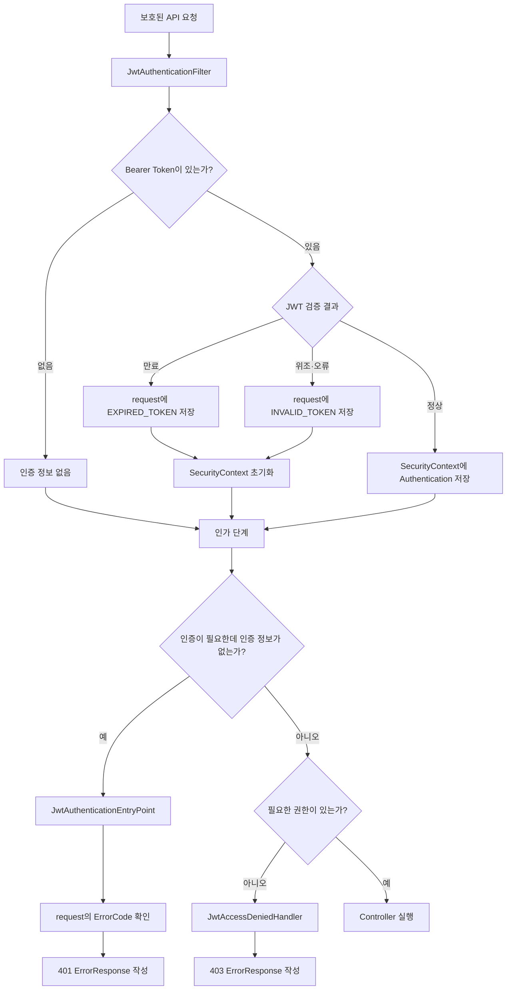

# 13. 인증·인가 오류 응답 표준화

- 커밋: `3cbf83d`
- 커밋 메시지: `feat: JWT 인증/인가 예외처리 표준화`

## 이번 단계에서 한 일

이전 단계까지는 JWT가 없거나 잘못되었을 때 Spring Security의 기본 응답이 반환될 수 있었다.

일반 API 예외는 `ErrorResponse` 형식으로 반환하고 있었지만, Security 필터에서 발생한 인증·인가 오류는 형식이 다를 수 있었다.

이번 단계에서는 모든 보안 오류도 다음 JSON 형식으로 반환하도록 만들었다.

```json
{
  "code": "ERROR_CODE",
  "message": "오류 설명"
}
```

추가한 기능은 다음과 같다.

```text
Security 오류 응답
├─ 토큰 없음       → 401 UNAUTHORIZED
├─ 잘못된 토큰     → 401 INVALID_TOKEN
├─ 만료된 토큰     → 401 EXPIRED_TOKEN
└─ 권한 부족       → 403 FORBIDDEN
```

## 변경된 파일

```text
src/main/java/com/example/emotiondiary/
├─ config/
│  └─ SecurityConfig.java
└─ security/jwt/
   ├─ JwtAuthenticationFilter.java
   ├─ JwtAuthenticationEntryPoint.java
   └─ JwtAccessDeniedHandler.java
```

## 기대하는 응답

| 상황 | HTTP 상태 | code | message |
|---|---:|---|---|
| 토큰 누락 | 401 | `UNAUTHORIZED` | 인증이 필요합니다 |
| 위조·잘못된 토큰 | 401 | `INVALID_TOKEN` | 유효하지 않은 토큰입니다 |
| 만료된 토큰 | 401 | `EXPIRED_TOKEN` | 만료된 토큰입니다 |
| USER의 관리자 API 접근 | 403 | `FORBIDDEN` | 접근 권한이 없습니다 |

클라이언트는 HTTP 상태뿐 아니라 `code`를 이용해 상황별 처리를 할 수 있다.

```text
EXPIRED_TOKEN
└─ Refresh Token으로 재발급 시도

INVALID_TOKEN
└─ 저장된 토큰 제거 후 다시 로그인 안내

UNAUTHORIZED
└─ 로그인 화면으로 이동

FORBIDDEN
└─ 권한이 없다는 안내 표시
```

## 왜 GlobalExceptionHandler만으로 부족할까?

Spring MVC의 일반적인 요청 흐름은 다음과 같다.

```text
요청
→ DispatcherServlet
→ Controller
→ Service
```

`@RestControllerAdvice`가 붙은 `GlobalExceptionHandler`는 주로 `DispatcherServlet` 안에서 Controller와 Service를 실행하다 발생한 예외를 처리한다.

하지만 Spring Security 필터는 `DispatcherServlet`보다 먼저 실행된다.

```text
요청
→ Spring Security Filter Chain
→ DispatcherServlet
→ Controller
```

필터 단계에서 요청이 차단되면 Controller까지 도착하지 않는다. 따라서 Controller 영역의 전역 예외 처리기에만 의존하면 Security 오류를 원하는 JSON으로 만들기 어렵다.

Spring Security는 이 경우를 위해 전용 처리 인터페이스를 제공한다.

```text
인증 실패
└─ AuthenticationEntryPoint

인가 실패
└─ AccessDeniedHandler
```

## 인증 실패와 인가 실패 복습

```text
인증 Authentication
└─ 요청한 사용자가 누구인지 확인

인가 Authorization
└─ 인증된 사용자가 기능을 사용할 권한이 있는지 확인
```

### AuthenticationEntryPoint가 처리하는 상황

현재 사용자를 인증할 수 없는데 인증이 필요한 API를 요청한 경우다.

```text
Authorization 헤더 없음
잘못된 JWT
만료된 JWT
```

HTTP 상태는 `401 Unauthorized`를 사용한다.

### AccessDeniedHandler가 처리하는 상황

사용자 인증은 성공했지만 필요한 권한이 없는 경우다.

```text
ROLE_USER 사용자
→ ADMIN 전용 API 요청
→ 권한 부족
```

HTTP 상태는 `403 Forbidden`을 사용한다.

## 전체 오류 처리 흐름



## JwtAuthenticationFilter 변경

이전에는 모든 JWT 오류를 하나의 `catch`에서 처리했다.

```java
catch (JwtException e) {
    log.debug("Invalid JWT: {}", e.getMessage());
    SecurityContextHolder.clearContext();
}
```

이 방식은 토큰이 만료됐는지, 변조됐는지 클라이언트가 구분할 수 없었다.

이번 커밋에서는 예외를 두 종류로 나누었다.

```java
} catch (ExpiredJwtException e) {
    request.setAttribute(
            JwtAuthenticationEntryPoint.ATTR_ERROR_CODE,
            ErrorCode.EXPIRED_TOKEN
    );
    SecurityContextHolder.clearContext();
} catch (JwtException e) {
    request.setAttribute(
            JwtAuthenticationEntryPoint.ATTR_ERROR_CODE,
            ErrorCode.INVALID_TOKEN
    );
    SecurityContextHolder.clearContext();
}
```

### ExpiredJwtException

```java
import io.jsonwebtoken.ExpiredJwtException;
```

JWT의 `exp`가 현재 시간보다 이전이면 발생하는 예외다.

```text
토큰 만료
→ ExpiredJwtException
→ EXPIRED_TOKEN 저장
```

### JwtException

```java
import io.jsonwebtoken.JwtException;
```

JWT 형식이 잘못됐거나 서명 검증에 실패하는 등 JWT 처리 전반의 오류를 나타내는 상위 예외다.

```text
토큰 문자열 손상
서명 불일치
지원하지 않는 JWT
→ JwtException
→ INVALID_TOKEN 저장
```

## catch 순서가 중요한 이유

`ExpiredJwtException`은 `JwtException`의 하위 타입이다.

```text
JwtException
└─ ExpiredJwtException
```

따라서 더 구체적인 `ExpiredJwtException`을 먼저 잡아야 한다.

```java
catch (ExpiredJwtException e) {
    // 먼저
} catch (JwtException e) {
    // 나중
}
```

만약 `JwtException`을 먼저 작성하면 만료 예외도 모두 상위 예외 처리로 들어간다. Java 컴파일러도 뒤의 `ExpiredJwtException` 처리 블록에 도달할 수 없다고 판단한다.

## request attribute란?

필터는 다음 코드로 요청 객체에 오류 정보를 저장한다.

```java
request.setAttribute("auth.error.code", ErrorCode.EXPIRED_TOKEN);
```

request attribute는 하나의 HTTP 요청이 처리되는 동안 서버 내부 컴포넌트끼리 값을 전달하는 저장 공간이다.

```text
JwtAuthenticationFilter
└─ request에 ErrorCode 저장
        ↓
JwtAuthenticationEntryPoint
└─ 같은 request에서 ErrorCode 조회
```

HTTP 요청 헤더나 JSON 본문을 바꾸는 것이 아니다. 서버 내부의 현재 `HttpServletRequest` 객체에만 붙는 값이다.

응답이 끝나면 함께 사라지므로 DB나 세션에 저장되지 않는다.

## 왜 필터에서 바로 응답하지 않을까?

필터가 직접 상태 코드와 JSON을 작성할 수도 있다.

하지만 이번 구조에서는 필터의 역할과 응답 작성 역할을 나눴다.

```text
JwtAuthenticationFilter
├─ 토큰 검사
├─ 실패 원인 결정
└─ request에 ErrorCode 표시

JwtAuthenticationEntryPoint
├─ 401 상태 설정
└─ ErrorResponse JSON 작성
```

이렇게 나누면 인증 실패 응답 형식을 한곳에서 관리할 수 있다.

필터는 오류를 잡은 뒤 `SecurityContext`를 비우고 다음 필터로 요청을 넘긴다. 이후 보호된 API의 인가 검사에서 인증 정보가 없다는 사실을 확인하면 `AuthenticationEntryPoint`가 실행된다.

## ATTR_ERROR_CODE 상수

```java
public static final String ATTR_ERROR_CODE = "auth.error.code";
```

필터와 EntryPoint가 같은 attribute 이름을 사용하도록 상수로 정의했다.

```text
문자열을 각각 직접 작성
→ 오타 가능성

하나의 상수 사용
→ 같은 키를 안전하게 공유
```

접근할 때는 다음처럼 클래스 이름과 함께 사용한다.

```java
JwtAuthenticationEntryPoint.ATTR_ERROR_CODE
```

`public static final`이므로 객체를 생성하지 않고 사용할 수 있고, 실행 중 값이 바뀌지 않는다.

## JwtAuthenticationEntryPoint

```java
@Component
@RequiredArgsConstructor
public class JwtAuthenticationEntryPoint
        implements AuthenticationEntryPoint {
}
```

인증되지 않은 사용자가 인증이 필요한 API에 접근할 때 `401` 응답을 작성한다.

### 필드와 메서드 정리

```text
JwtAuthenticationEntryPoint
├─ ATTR_ERROR_CODE: request에서 ErrorCode를 찾을 키
├─ objectMapper: Java 객체를 JSON으로 변환
└─ commence(): 인증 실패 응답 작성
```

### commence()

```java
public void commence(HttpServletRequest request,
                     HttpServletResponse response,
                     AuthenticationException authException)
        throws IOException {
}
```

Spring Security가 인증 실패를 처리해야 할 때 자동으로 호출한다.

매개변수의 의미는 다음과 같다.

```text
request
└─ 현재 HTTP 요청과 attribute 확인

response
└─ 상태 코드와 JSON 응답 작성

authException
└─ 인증 실패를 나타내는 Spring Security 예외
```

이번 코드에서는 `authException`의 내용을 직접 사용하지 않고 request에 저장된 `ErrorCode`를 사용한다.

### ErrorCode 읽기

```java
ErrorCode code = (ErrorCode) request.getAttribute(ATTR_ERROR_CODE);
```

JWT 필터가 저장한 오류 코드를 가져온다.

`getAttribute()`의 반환 타입은 `Object`이므로 `(ErrorCode)`로 타입을 변환한다.

### 기본값 처리

```java
if (code == null) code = ErrorCode.UNAUTHORIZED;
```

토큰 자체가 없으면 JWT 필터가 저장할 오류 코드도 없다.

따라서 attribute가 없을 때는 일반적인 인증 필요 오류를 사용한다.

```text
attribute 있음
├─ EXPIRED_TOKEN
└─ INVALID_TOKEN

attribute 없음
└─ UNAUTHORIZED
```

### HTTP 상태 설정

```java
response.setStatus(code.getStatus().value());
```

`ErrorCode`가 가진 `HttpStatus`를 숫자로 바꿔 응답 상태에 넣는다.

```text
HttpStatus.UNAUTHORIZED
→ value()
→ 401
```

### Content-Type 설정

```java
response.setContentType("application/json;charset=UTF-8");
```

응답 본문이 UTF-8로 인코딩된 JSON이라는 것을 클라이언트에 알려준다.

한글 메시지가 깨지지 않도록 charset도 지정했다.

### JSON 응답 작성

```java
objectMapper.writeValue(
        response.getOutputStream(),
        ErrorResponse.builder()
                .code(code.getCode())
                .message(code.getDefaultMessage())
                .build()
);
```

`ErrorResponse` Java 객체를 JSON으로 바꾸어 HTTP 응답 출력 스트림에 직접 작성한다.

Controller에서 `ResponseEntity`를 반환하는 것이 아니다. 요청이 Controller까지 도달하지 못했기 때문에 `HttpServletResponse`에 직접 쓴다.

## ObjectMapper

`ObjectMapper`는 Java 객체와 JSON 사이의 변환을 담당한다.

```text
ErrorResponse 객체
├─ code = "UNAUTHORIZED"
└─ message = "인증이 필요합니다"
        ↓ ObjectMapper
JSON 문자열
{
  "code": "UNAUTHORIZED",
  "message": "인증이 필요합니다"
}
```

프로젝트는 Spring Boot 4와 Jackson 3을 사용하므로 커밋의 import는 다음과 같다.

```java
import tools.jackson.databind.ObjectMapper;
```

인터넷의 Spring Boot 3 이하 예제에서는 다음 import를 자주 볼 수 있다.

```java
import com.fasterxml.jackson.databind.ObjectMapper;
```

라이브러리 세대가 다르므로 현재 프로젝트에서 자동 완성되는 `tools.jackson.databind.ObjectMapper`를 사용하는 것이 맞다.

`@RequiredArgsConstructor`가 `ObjectMapper`를 받는 생성자를 만들고, Spring Boot가 준비한 Bean을 주입한다.

직접 `new ObjectMapper()`를 만들지 않기 때문에 Spring의 공통 JSON 설정도 사용할 수 있다.

## IOException

`commence()`는 응답 출력 스트림에 JSON을 쓰므로 입출력 오류가 발생할 수 있다.

필요한 import는 다음과 같다.

```java
import java.io.IOException;
```

이 import가 없으면 다음과 같은 컴파일 오류가 발생한다.

```text
cannot find symbol
symbol: class IOException
```

## JwtAccessDeniedHandler

```java
@Component
@RequiredArgsConstructor
public class JwtAccessDeniedHandler
        implements AccessDeniedHandler {
}
```

인증된 사용자에게 필요한 권한이 없을 때 `403` 응답을 작성한다.

### 필드와 메서드 정리

```text
JwtAccessDeniedHandler
├─ objectMapper: ErrorResponse를 JSON으로 변환
└─ handle(): 권한 부족 응답 작성
```

### handle()

```java
public void handle(HttpServletRequest request,
                   HttpServletResponse response,
                   AccessDeniedException accessDeniedException)
        throws IOException {
}
```

매개변수의 의미는 다음과 같다.

```text
request
└─ 현재 HTTP 요청

response
└─ 403 상태와 JSON 응답 작성

accessDeniedException
└─ 권한 부족을 나타내는 예외
```

이번 구현에서는 모든 권한 부족 상황에 같은 `FORBIDDEN` 코드를 사용하므로 request와 예외의 세부 정보를 따로 읽지는 않는다.

### 403 응답 작성

```java
response.setStatus(ErrorCode.FORBIDDEN.getStatus().value());
response.setContentType("application/json;charset=UTF-8");
objectMapper.writeValue(
        response.getOutputStream(),
        ErrorResponse.builder()
                .code(ErrorCode.FORBIDDEN.getCode())
                .message(ErrorCode.FORBIDDEN.getDefaultMessage())
                .build()
);
```

결과는 다음과 같다.

```http
HTTP/1.1 403 Forbidden
Content-Type: application/json;charset=UTF-8

{
  "code": "FORBIDDEN",
  "message": "접근 권한이 없습니다"
}
```

## 두 처리기 비교

| 구분 | JwtAuthenticationEntryPoint | JwtAccessDeniedHandler |
|---|---|---|
| 실패 종류 | 인증 실패 | 인가 실패 |
| 사용자 확인 | 되지 않음 | 완료됨 |
| 대표 상황 | 토큰 없음·위조·만료 | USER가 ADMIN API 요청 |
| HTTP 상태 | 401 | 403 |
| 실행 메서드 | `commence()` | `handle()` |

간단히 기억하면 다음과 같다.

```text
누구인지 모름
→ EntryPoint
→ 401

누구인지는 알지만 권한 없음
→ AccessDeniedHandler
→ 403
```

## SecurityConfig에 등록

처리 클래스를 `@Component`로 만드는 것만으로는 Security Filter Chain이 이 객체를 사용한다는 보장이 없다.

`SecurityConfig`에 주입하고 예외 처리 설정에 등록했다.

### 필드 추가

```java
private final JwtAuthenticationEntryPoint authenticationEntryPoint;
private final JwtAccessDeniedHandler accessDeniedHandler;
```

`@RequiredArgsConstructor`가 생성자를 만들고 Spring이 두 Bean을 주입한다.

### exceptionHandling()

```java
.exceptionHandling(ex -> ex
        .authenticationEntryPoint(authenticationEntryPoint)
        .accessDeniedHandler(accessDeniedHandler)
)
```

이 설정의 의미는 다음과 같다.

```text
Security Filter Chain에서 인증 실패
→ authenticationEntryPoint 사용

Security Filter Chain에서 인가 실패
→ accessDeniedHandler 사용
```

필터 등록 뒤에 체이닝하여 작성했지만, 이것은 설정 코드를 읽는 순서다. 실제 요청 처리 순서가 단순히 이 코드 줄 순서와 완전히 같다는 뜻은 아니다. Spring Security가 구성한 필터 체인 안에서 각 컴포넌트가 자신의 역할에 맞는 시점에 실행된다.

## 시나리오별 상세 흐름

### 1. 토큰 없이 일기 목록 요청

```http
GET /api/diaries
```

```text
Authorization 헤더 없음
→ JwtAuthenticationFilter가 토큰을 찾지 못함
→ SecurityContext에 인증 정보 없음
→ 보호된 API의 authenticated 조건 실패
→ JwtAuthenticationEntryPoint 실행
→ request attribute가 없으므로 UNAUTHORIZED 선택
```

응답:

```json
{
  "code": "UNAUTHORIZED",
  "message": "인증이 필요합니다"
}
```

### 2. 위조된 토큰으로 요청

토큰의 글자 하나를 바꾸는 경우다.

```text
JWT 서명 검증 실패
→ JwtException
→ request에 INVALID_TOKEN 저장
→ SecurityContext 초기화
→ 보호된 API 인증 실패
→ JwtAuthenticationEntryPoint 실행
→ INVALID_TOKEN 응답
```

응답:

```json
{
  "code": "INVALID_TOKEN",
  "message": "유효하지 않은 토큰입니다"
}
```

### 3. 만료된 토큰으로 요청

```text
JWT exp 만료
→ ExpiredJwtException
→ request에 EXPIRED_TOKEN 저장
→ SecurityContext 초기화
→ 보호된 API 인증 실패
→ JwtAuthenticationEntryPoint 실행
→ EXPIRED_TOKEN 응답
```

응답:

```json
{
  "code": "EXPIRED_TOKEN",
  "message": "만료된 토큰입니다"
}
```

### 4. USER 토큰으로 관리자 API 요청

```http
GET /api/admin/users
Authorization: Bearer <USER Access Token>
```

```text
JWT는 정상
→ 사용자 인증 성공
→ ROLE_USER 권한 저장
→ 관리자 권한 검사 실패
→ AccessDeniedException
→ 403 FORBIDDEN 응답
```

응답:

```json
{
  "code": "FORBIDDEN",
  "message": "접근 권한이 없습니다"
}
```

## GlobalExceptionHandler와의 관계

프로젝트에는 이미 다음 예외 처리기가 있다.

```text
GlobalExceptionHandler
├─ BusinessException
├─ MethodArgumentNotValidException
├─ AccessDeniedException
└─ 일반 Exception
```

새로 추가한 두 처리기와 역할을 구분하면 다음과 같다.

```text
Controller·Service 영역의 일반 예외
→ GlobalExceptionHandler

Security Filter Chain의 인증 실패
→ JwtAuthenticationEntryPoint

Security Filter Chain의 인가 실패
→ JwtAccessDeniedHandler
```

`@PreAuthorize` 같은 메서드 보안에서 발생한 `AccessDeniedException`은 요청 처리 위치에 따라 MVC의 `GlobalExceptionHandler`가 처리할 수 있다. 반면 Controller에 들어오기 전 필터 단계의 실패는 Security 전용 처리기가 담당한다.

어느 경로에서 처리되더라도 같은 `ErrorCode.FORBIDDEN`과 `ErrorResponse`를 사용하므로 클라이언트가 받는 형식을 일관되게 유지할 수 있다.

## API 테스트 방법

### 토큰 누락 테스트

```http
GET http://localhost:8080/api/diaries?from=0&to=9999999999999
```

기대 결과:

```text
HTTP 401
code: UNAUTHORIZED
```

### 위조 토큰 테스트

정상 Access Token의 마지막 글자 등을 바꿔 요청한다.

```http
Authorization: Bearer <변조한 토큰>
```

기대 결과:

```text
HTTP 401
code: INVALID_TOKEN
```

### 만료 토큰 테스트

학습할 때 Access Token 만료 시간을 짧게 설정한 후 로그인하고 만료될 때까지 기다릴 수 있다.

```yaml
jwt:
  member:
    access-exp-min: 1
```

기대 결과:

```text
HTTP 401
code: EXPIRED_TOKEN
```

테스트가 끝나면 설정값을 원래 값으로 돌려놓는다.

### 권한 부족 테스트

USER 역할이 들어 있는 새 Access Token으로 요청한다.

```http
GET http://localhost:8080/api/admin/users
Authorization: Bearer <USER Access Token>
```

기대 결과:

```text
HTTP 403
code: FORBIDDEN
```

## 이번 코드에서 주의할 점

### 1. 공개 API에서는 EntryPoint가 실행되지 않을 수 있다

JWT 필터가 잘못된 토큰을 발견하면 request에 오류 코드를 저장하고 인증 정보를 비운 뒤 요청을 계속 진행한다.

요청 경로가 `permitAll()`이면 인증 정보가 없어도 접근할 수 있으므로 `AuthenticationEntryPoint`가 실행되지 않을 수 있다.

```text
잘못된 토큰 + 보호된 API
→ 인증 필요
→ EntryPoint 실행

잘못된 토큰 + permitAll API
→ 인증 필수 아님
→ Controller 실행 가능
```

공개 API에서 잘못된 토큰이 함께 전달됐을 때 요청 자체를 거부할지, 토큰을 무시하고 허용할지는 서비스 정책에 따라 정해야 한다.

### 2. 필터가 모든 예외를 잡는 것은 아니다

현재 코드는 `ExpiredJwtException`과 `JwtException`을 처리한다.

예를 들어 `sub`가 숫자가 아니어서 `Long.valueOf()`에서 발생하는 `NumberFormatException`은 `JwtException`이 아니므로 이 `catch`에 잡히지 않는다.

토큰에서 값을 꺼내 변환하는 과정의 예외까지 어떤 오류 코드로 처리할지 추가로 정할 수 있다.

### 3. Access Token과 Refresh Token 종류 검사는 여전히 필요하다

JWT 서명과 만료 여부만으로는 Access Token인지 Refresh Token인지 구분하지 못한다. JWT 인증 필터는 Access Token만 받고, 재발급 API는 Refresh Token만 받도록 토큰 타입 클레임을 검증하는 것이 안전하다.

### 4. 응답이 이미 작성되었는지 주의해야 한다

필터나 처리기에서 응답 본문을 여러 번 작성하면 JSON이 중복되거나 `response already committed` 문제가 생길 수 있다.

현재처럼 응답 작성 책임을 EntryPoint와 AccessDeniedHandler에 모으는 것이 관리하기 쉽다.

### 5. 로그 정책도 필요하다

잘못된 토큰은 자주 들어올 수 있으므로 모든 경우를 큰 오류 로그로 남기면 로그가 과도하게 쌓일 수 있다. 토큰 원문은 민감 정보이므로 로그에 출력하면 안 된다.

필요하다면 오류 종류, 요청 경로, 발생 시각 정도만 적절한 로그 레벨로 기록한다.

## 개선 아이디어

학습이 더 진행되면 다음 내용을 고려할 수 있다.

```text
Security 오류 처리 개선
├─ 응답 작성 공통 메서드 분리
├─ Access·Refresh 토큰 타입 검증
├─ 잘못된 sub와 claim 타입 예외 처리
├─ API별 보안 통합 테스트 작성
├─ 토큰 원문을 제외한 보안 로그 추가
└─ CORS 오류 응답 정책 확인
```

EntryPoint와 AccessDeniedHandler에는 상태와 JSON을 작성하는 코드가 비슷하다. 공통 응답 작성 클래스로 분리하면 중복을 줄일 수 있다.

## 핵심 정리

```text
JwtAuthenticationFilter
├─ JWT 검증
├─ 만료 시 EXPIRED_TOKEN을 request에 저장
├─ 그 외 JWT 오류 시 INVALID_TOKEN 저장
└─ 인증 실패 시 SecurityContext 초기화

JwtAuthenticationEntryPoint
├─ 인증 실패 담당
├─ request의 ErrorCode 조회
├─ 오류 코드가 없으면 UNAUTHORIZED 사용
└─ 401 ErrorResponse JSON 작성

JwtAccessDeniedHandler
├─ 인가 실패 담당
└─ 403 FORBIDDEN JSON 작성

SecurityConfig
└─ 두 Security 오류 처리기를 Filter Chain에 등록
```

이번 단계의 핵심은 다음 한 문장으로 정리할 수 있다.

> Controller 전에 발생하는 Spring Security 오류는 Security 전용 처리기로 응답하고, JWT 필터가 전달한 실패 원인에 따라 일관된 `ErrorResponse` JSON을 반환한다.

## 복습 질문

1. Security 필터에서 발생한 오류가 `GlobalExceptionHandler`에 잡히지 않을 수 있는 이유는 무엇일까?
2. `AuthenticationEntryPoint`와 `AccessDeniedHandler`는 각각 어떤 실패를 처리할까?
3. 토큰 누락과 권한 부족은 각각 어떤 HTTP 상태를 사용할까?
4. `ExpiredJwtException`을 `JwtException`보다 먼저 잡아야 하는 이유는 무엇일까?
5. request attribute는 무엇이며 이 코드에서는 어떤 값을 전달할까?
6. 토큰이 없을 때 `ATTR_ERROR_CODE`가 `null`인 이유는 무엇일까?
7. `ObjectMapper`는 어떤 역할을 할까?
8. EntryPoint가 `ResponseEntity` 대신 `HttpServletResponse`에 직접 쓰는 이유는 무엇일까?
9. 잘못된 토큰으로 `permitAll()` API를 요청하면 EntryPoint가 실행되지 않을 수 있는 이유는 무엇일까?
10. JWT의 `sub`가 숫자가 아닐 때 현재 필터에서 별도 처리가 필요한 이유는 무엇일까?
